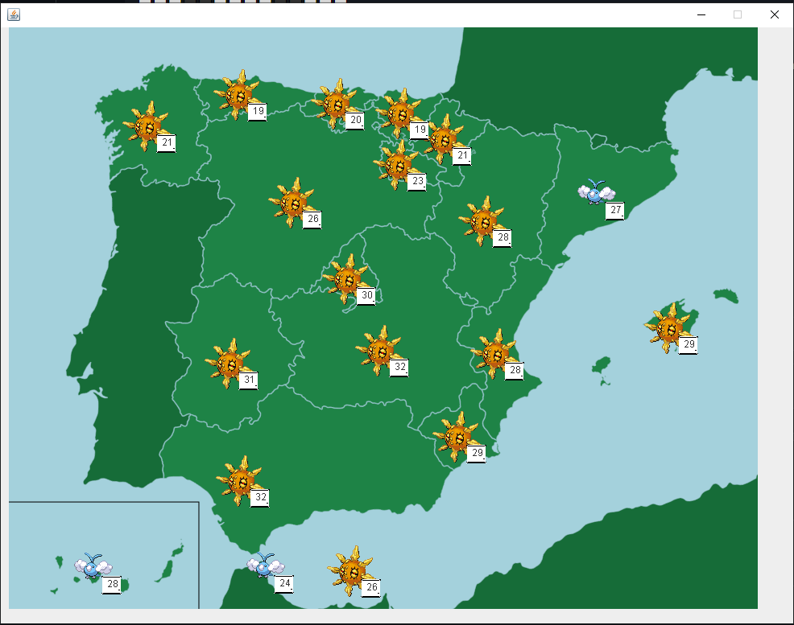

```
⬜⬜⬜⬜⬜⬛⬛⬛⬛⬜⬜⬜⬜⬜
⬜⬜⬜⬛⬛🟥🟥🟥🟥🟥⬛⬜⬜⬜
⬜⬜⬛🟥🟥🟥🟥🟥🟥🟥🟥⬛⬜⬜
⬜⬛🟥🟥🟥🟥🟥🟥🟥🟥🟥🟥⬛⬜        ____        __           _______                          
⬜⬛🟥🟥🟥🟥🟥🟥🟥🟥🟥🟥⬛⬜       / __ \____  / /_____     /_  __(_)__  ____ ___  ____  ____ 
⬛🟥🟥🟥🟥🟥⬛⬛🟥🟥🟥🟥🟥⬛      / /_/ / __ \/ //_/ _ \     / / / / _ \/ __ `__ \/ __ \/ __ \
⬛🟥🟥🟥🟥⬛⬜⬜⬛🟥🟥🟥🟥⬛     / ____/ /_/ / ,< /  __/    / / / /  __/ / / / / / /_/ / /_/ /
⬛⬛⬛⬛⬛⬛⬜⬜⬛⬛⬛⬛⬛⬛    /_/    \____/_/|_|\___/    /_/ /_/\___/_/ /_/ /_/ .___/\____/ 
⬛⬜⬜⬜⬜⬜⬛⬛⬜⬜⬜⬜⬜⬛                                               /_/            
⬜⬛⬜⬜⬜⬜⬜⬜⬜⬜⬜⬜⬛⬜
⬜⬛⬜⬜⬜⬜⬜⬜⬜⬜⬜⬜⬛⬜
⬜⬜⬛⬜⬜⬜⬜⬜⬜⬜⬜⬛⬜⬜
⬜⬜⬜⬛⬛⬜⬜⬜⬜⬛⬛⬜⬜⬜
⬜⬜⬜⬜⬜⬛⬛⬛⬛⬜⬜⬜⬜⬜
```

<div align="right">
A kotlin based program to forecast Spain weathers for tomorrow
</div>


<div align="center">

</div>

# Technologies
* Kotlin 1.6.0
* `kotlinx.serialzation`
* `javax.swing`
* Jackson for JSON serialization and deserialization
* Ktor HTTP Client

# [API REST from Aemet](https://opendata.aemet.es/centrodedescargas/inicio)


